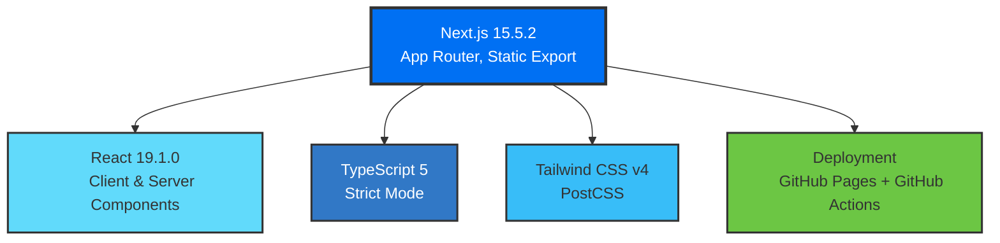
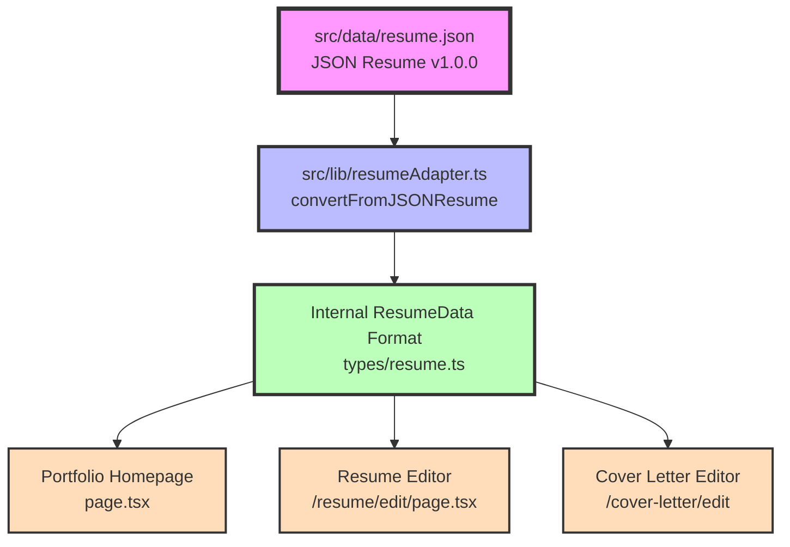

# Architecture Deep Dive

> **For:** Technical users, developers, and future Claude Code sessions
> **Purpose:** Complete technical architecture reference with implementation details
> **Last Updated:** 2025-01-25

## Table of Contents

1. [System Overview](#system-overview)
2. [Data Architecture](#data-architecture)
3. [Component Architecture](#component-architecture)
4. [Authentication & Security](#authentication--security)
5. [AI Integration](#ai-integration)
6. [Build & Deployment Pipeline](#build--deployment-pipeline)
7. [Testing Strategy](#testing-strategy)
8. [Performance Optimizations](#performance-optimizations)
9. [Troubleshooting Guide](#troubleshooting-guide)

---

## System Overview

### Technology Stack



### Core Dependencies

| Category | Library | Version | Purpose |
|----------|---------|---------|---------|
| **UI Framework** | Next.js | 15.5.2 | React framework with SSG |
| **Styling** | Tailwind CSS | v4 | Utility-first CSS |
| **Animations** | Framer Motion | 12.23.12 | Page transitions, scrolling |
| **Forms/DnD** | @hello-pangea/dnd | 18.0.1 | Drag-drop resume sections |
| **Validation** | AJV + ajv-formats | 8.17.1, 3.0.1 | JSON Resume schema validation |
| **Auth** | bcryptjs | 3.0.3 | Password hashing (client-side) |
| **Notifications** | Sonner | 2.0.7 | Toast notifications |
| **Icons** | Lucide React, React Icons | 0.542.0, 5.2.1 | UI icons |
| **Image Processing** | Sharp | 0.34.3 | OG image generation |
| **Testing** | Jest + RTL | 30.2.0, 16.3.0 | Unit & integration tests |
| **SEO** | next-sitemap | 4.2.3 | Auto-generated sitemaps |

### Build Configuration

**Next.js Config** (`next.config.ts`):
```typescript
{
  output: 'export',              // Static site generation
  trailingSlash: true,           // Add trailing slashes to URLs
  skipTrailingSlashRedirect: true,
  distDir: 'out',                // Output directory
  images: { unoptimized: true }, // GitHub Pages compatibility
  eslint: { ignoreDuringBuilds: true },
  typescript: { ignoreBuildErrors: true }
}
```

**TypeScript Config** (`tsconfig.json`):
```json
{
  "compilerOptions": {
    "target": "ES2017",
    "strict": true,
    "paths": { "@/*": ["./src/*"] }  // Path alias
  }
}
```

---

## Data Architecture

### Single Source of Truth: JSON Resume Standard

**File:** `src/data/resume.json`
**Format:** [JSON Resume v1.0.0](https://jsonresume.org/schema/)
**Purpose:** Canonical data source for entire portfolio

#### Data Flow Diagram



### Adapter Pattern Implementation

The project uses **bidirectional adapter pattern** for data transformation:

#### 1. JSON Resume → Internal Format

**File:** `src/lib/resumeAdapter.ts`

```typescript
function convertFromJSONResume(jsonResume: JSONResume): ResumeData {
  // Key transformations:
  // - basics.profiles[] → socialMedia[]
  // - work[].highlights[] → workExperience[].keyAchievements (string)
  // - skills[].keywords[] → skills[].skills[] (Skill objects)
  // - location.{address,city,region,postal} → address (string)
}
```

**Transformations:**
- **Social Media:** `basics.profiles` → `socialMedia[]` (adds Website from `basics.url`)
- **Work Experience:** `work[].highlights` (array) → `keyAchievements` (newline-separated string)
- **Skills:** `skills[].keywords` (strings) → `skills[]` (objects with `text`, `highlight`)
- **Location:** Concatenates `address, city, region postalCode` into single string
- **URLs:** Strips `https://` prefix from all URLs for cleaner display

#### 2. Internal Format → JSON Resume

**File:** `src/lib/jsonResume.ts`

```typescript
function convertToJSONResume(customData?: ResumeData): JSONResume {
  // Reverse transformations:
  // - socialMedia[] → basics.profiles[]
  // - keyAchievements (string) → work[].highlights[] (split by \n)
  // - skills[].skills[] → skills[].keywords[]
  // - address (string) → location.{address,city,region,postal}
}
```

**Features:**
- Validates output using AJV schema validator
- Adds `https://` back to URLs
- Parses address string using regex patterns
- Includes JSON Resume schema reference

#### 3. JSON Resume Validation

**File:** `src/lib/jsonResumeSchema.ts`

```typescript
import Ajv from "ajv";
import addFormats from "ajv-formats";

function validateJSONResume(data: any): { valid: boolean; errors: string[] } {
  // Validates against official JSON Resume schema
  // Returns detailed error messages with paths
}
```

**Features:**
- Official JSON Resume v1.0.0 schema embedded
- Email, URL, URI format validation
- Detailed error reporting with property paths
- Non-strict mode (allows additional properties)

#### 4. Portfolio Display Transform

**File:** `src/lib/data/portfolio.ts`

```typescript
// Transforms ResumeData → Portfolio display types
export const contactInfo: ContactInfo = { ... }
export const summary: string = resumeData.summary
export const skills: Skill[] = resumeData.skills.map(...)
export const experience: Experience[] = resumeData.workExperience.map(...)
export const projects: Project[] = [ ... ]
```

**Transformations:**
- Extracts LinkedIn, GitHub, Website from social media
- Formats dates: ISO string → "Mon YYYY - Mon YYYY"
- Splits keyAchievements by newline for bullet points
- Parses location from address string (regex-based)

### Type System

**4 Distinct Type Layers:**

```typescript
// 1. External Standard (jsonresume.org)
types/json-resume.ts
  → JSONResume, JSONResumeBasics, JSONResumeWork, etc.

// 2. Internal Application Types
types/resume.ts
  → ResumeData, WorkExperience, Education, SkillGroup, Skill

// 3. Display/UI Types
types/portfolio.ts
  → Experience, Skill, Project, ContactInfo

// 4. Feature-Specific Types
types/cover-letter.ts
  → CoverLetterData
types/openai.ts
  → OpenAIConfig, OpenAIRequest, OpenAIResponse
```

---

## Component Architecture

### App Router Structure

```
src/app/
├── layout.tsx                 # Root layout (fonts, metadata)
├── page.tsx                   # Homepage
├── globals.css                # Global styles (Tailwind)
├── opengraph-image.tsx       # Dynamic OG image (@vercel/og)
├── twitter-image.tsx         # Twitter card image
│
├── resume/
│   ├── layout.tsx            # Resume-specific layout
│   ├── page.tsx              # Print-optimized view (auto-triggers print)
│   └── edit/
│       ├── page.tsx          # Password-protected resume editor
│       └── __tests__/        # Integration tests (4 files)
│
├── cover-letter/
│   └── edit/
│       ├── page.tsx          # Password-protected cover letter editor
│       └── __tests__/        # Integration tests (2 files)
│
├── book/
│   ├── layout.tsx
│   └── page.tsx              # Calendar redirect (Google Calendar)
│
└── resume.json/
    └── route.ts              # JSON Resume API endpoint (static)
```

### Component Hierarchy

#### Homepage (`src/app/page.tsx`)

```jsx
<div>
  <Header />
  <main>
    <Hero />      {/* Name, title, contact buttons */}
    <About />     {/* Professional summary */}
    <Skills />    {/* Grouped technical skills */}
    <Experience />{/* Work history timeline */}
    <Contact />   {/* Contact form/info */}
  </main>
  <Footer />
</div>
```

**Data Source:** All sections pull from `src/lib/data/portfolio.ts`

#### Resume Editor (`src/app/resume/edit/page.tsx`)

```jsx
<PasswordProtection>
  <Toaster />
  <ResumeContext.Provider value={resumeData, setResumeData, handlers}>

    {/* Left Panel: Form Editor */}
    <form className="exclude-print">
      <LoadUnload />           {/* Import/Export JSON Resume */}
      <PersonalInformation />  {/* Name, email, phone, address */}
      <SocialMedia />          {/* LinkedIn, GitHub, Website */}
      <Summary />              {/* Professional summary (AI-assisted) */}
      <WorkExperience />       {/* Jobs with drag-drop reordering */}
      <Education />            {/* Degrees */}
      <Skill />                {/* Skill groups */}
      <Language />             {/* Languages */}
      <Certification />        {/* Certifications */}
    </form>

    {/* Right Panel: Live Preview */}
    <Preview resumeData={resumeData} />

    {/* Floating Actions */}
    <PrintButton />
  </ResumeContext.Provider>
</PasswordProtection>
```

**Key Features:**
- **Real-time preview:** Form changes instantly reflect in preview
- **Drag-and-drop:** Reorder work experience, education, skills
- **localStorage persistence:** Auto-saves form state
- **JSON Resume import/export:** Full compatibility
- **AI-assisted summary:** Generate summaries using OpenAI API

#### Cover Letter Editor (`src/app/cover-letter/edit/page.tsx`)

```jsx
<PasswordProtection>
  <Toaster />
  <DocumentContext.Provider>

    {/* Left Panel: Form */}
    <form className="exclude-print">
      <LoadUnload />           {/* Import/Export */}
      <PersonalInformation />  {/* Reuses resume personal info */}
      <SocialMedia />
      <CoverLetterContent />   {/* AI-assisted content generation */}
    </form>

    {/* Right Panel: Live Preview */}
    <CoverLetterPreview />

    {/* Floating Actions */}
    <PrintButton />
  </DocumentContext.Provider>
</PasswordProtection>
```

**Key Features:**
- **AI generation:** Generate tailored cover letters from job descriptions
- **Personal info reuse:** Pulls data from resume.json
- **Streaming responses:** Real-time AI output display
- **localStorage persistence**

### Shared Component Library

#### Document Builder Components (`src/components/document-builder/`)

**Purpose:** Reusable components shared between resume & cover letter editors

```
document-builder/
├── shared-forms/
│   ├── PersonalInformation.tsx     # Name, email, phone, address
│   ├── SocialMedia.tsx             # Social profile links
│   ├── LoadUnload.tsx              # Import/Export JSON Resume
│   └── AITextAreaWithButton.tsx   # Textarea + AI generate button
│
├── shared-preview/
│   ├── ProfileHeader.tsx           # Name/position header
│   └── ContactInfo.tsx             # Contact details section
│
└── ui/
    └── PrintButton.tsx             # Print document button
```

#### Resume-Specific Components (`src/components/resume/`)

```
resume/
├── forms/
│   ├── WorkExperience.tsx          # Jobs (drag-drop, add/remove)
│   ├── Education.tsx               # Degrees
│   ├── Skill.tsx                   # Skill groups
│   ├── Language.tsx                # Languages
│   ├── Certification.tsx           # Certifications
│   ├── Summary.tsx                 # Professional summary (AI)
│   └── Projects.tsx                # Projects (optional)
│
└── preview/
    ├── Preview.tsx                 # Full resume preview
    └── Skills.tsx                  # Skills section rendering
```

#### Cover Letter Components (`src/components/cover-letter/`)

```
cover-letter/
├── forms/
│   ├── CoverLetterContent.tsx      # Main content textarea
│   └── AIGenerateModal.tsx         # AI generation modal
│
└── preview/
    └── CoverLetterPreview.tsx      # Full cover letter preview
```

### Context & State Management

#### DocumentContext (`src/lib/contexts/DocumentContext.tsx`)

```typescript
// Shared context for resume and cover letter editors
export const ResumeContext = createContext<{
  resumeData: ResumeData;
  setResumeData: (data: ResumeData) => void;
  handleProfilePicture: (url: string) => void;
  handleChange: (field: string, value: any) => void;
}>();
```

**Usage:** Provides state and handlers to all form components

#### Custom Hooks (`src/lib/hooks/`)

```typescript
// useDocumentHandlers.ts
export function useDocumentHandlers(resumeData, setResumeData) {
  const handleProfilePicture = (url: string) => { ... }
  const handleChange = (field: string, value: any) => { ... }
  return { handleProfilePicture, handleChange }
}

// useKeyboardShortcut.tsx
export function useKeyboardShortcut(key: string, callback: () => void) {
  // Ctrl/Cmd + key → callback
}
```

---

## Authentication & Security

### Password Protection System

**Status:** Optional, disabled by default
**Scope:** `/resume/edit` and `/cover-letter/edit` pages

#### Architecture

```
┌────────────────────────────────────────────────────────────┐
│ Environment Variables                                       │
│ - NEXT_PUBLIC_EDIT_PASSWORD_HASH (bcrypt hash)            │
│   - If SET → Password protection ENABLED                   │
│   - If NOT SET → Public access (no password)               │
└────────────────┬───────────────────────────────────────────┘
                 │
                 ▼
┌────────────────────────────────────────────────────────────┐
│ src/config/password.ts                                     │
│ - getPasswordHash() → Returns hash or undefined           │
│ - isPasswordProtectionEnabled() → boolean                 │
└────────────────┬───────────────────────────────────────────┘
                 │
                 ▼
┌────────────────────────────────────────────────────────────┐
│ src/components/auth/PasswordProtection.tsx                │
│ - Wraps edit pages                                         │
│ - Checks sessionStorage for existing auth                  │
│ - bcrypt.compare(password, hash) for validation           │
│ - Session expires after 24 hours                           │
└────────────────────────────────────────────────────────────┘
```

#### Implementation Details

**File:** `src/components/auth/PasswordProtection.tsx`

```typescript
const SESSION_KEY = 'edit-auth-token';
const SESSION_EXPIRY_KEY = 'edit-auth-expiry';
const SESSION_DURATION = 1000 * 60 * 60 * 24; // 24 hours

export default function PasswordProtection({ children }) {
  const [isAuthenticated, setIsAuthenticated] = useState(false);
  const [isChecking, setIsChecking] = useState(true);

  useEffect(() => {
    // If password protection disabled, grant immediate access
    if (!isPasswordProtectionEnabled()) {
      setIsAuthenticated(true);
      setIsChecking(false);
      return;
    }

    // Check sessionStorage for valid token
    const token = sessionStorage.getItem(SESSION_KEY);
    const expiry = sessionStorage.getItem(SESSION_EXPIRY_KEY);

    if (token === 'authenticated' && expiry) {
      const expiryTime = parseInt(expiry, 10);
      if (Date.now() < expiryTime) {
        setIsAuthenticated(true);
      } else {
        // Session expired
        sessionStorage.removeItem(SESSION_KEY);
        sessionStorage.removeItem(SESSION_EXPIRY_KEY);
      }
    }

    setIsChecking(false);
  }, []);

  const handleSubmit = async (e) => {
    e.preventDefault();

    // Validate password using bcrypt
    const isValid = await bcrypt.compare(password, passwordHash);

    if (isValid) {
      // Set session with 24-hour expiry
      const expiryTime = Date.now() + SESSION_DURATION;
      sessionStorage.setItem(SESSION_KEY, 'authenticated');
      sessionStorage.setItem(SESSION_EXPIRY_KEY, expiryTime.toString());
      setIsAuthenticated(true);
    } else {
      setError('Incorrect password');
    }
  };

  // Render: Loading → Password Form → Protected Content
}
```

**Security Features:**
- **bcrypt hashing:** Cost factor 10 (2^10 = 1024 rounds)
- **Session-based:** 24-hour sessionStorage tokens
- **Client-side validation:** No server required for static sites
- **Shared session:** Resume + Cover Letter share auth state
- **Auto-logout:** Session cleanup on logout
- **Show/hide password toggle**

**Limitations (Client-Side Auth):**
- ⚠️ Can be bypassed by inspecting built files
- ⚠️ Suitable for personal portfolios, not production apps
- ✅ Deters casual access
- ✅ No server/database required

#### Setup Process

**1. Generate Password Hash:**
```bash
node scripts/generate-password-hash.js "your-password"
```

**2. Local Development:**
```bash
# .env.local
NEXT_PUBLIC_EDIT_PASSWORD_HASH="$2b$10$..."
```

**3. Production (GitHub Secrets):**
```
Settings → Secrets → Actions → New repository secret
Name: NEXT_PUBLIC_EDIT_PASSWORD_HASH
Value: $2b$10$...
```

**4. Password Config File:**
```typescript
// src/config/password.ts
export function getPasswordHash(): string | undefined {
  // Try window object (build-time injection)
  if (isBrowser() && (window as any).__PASSWORD_HASH__) {
    return (window as any).__PASSWORD_HASH__;
  }

  // Try environment variable
  return process.env.NEXT_PUBLIC_EDIT_PASSWORD_HASH || undefined;
}

export function isPasswordProtectionEnabled(): boolean {
  return getPasswordHash() !== undefined;
}
```

---

## AI Integration

### OpenAI-Compatible API Client

**Purpose:** Generate cover letters and summaries using AI models
**Compatibility:** OpenAI API, OpenRouter, local Ollama, vLLM, etc.

#### Architecture

```
┌────────────────────────────────────────────────────────────┐
│ Client Configuration (Modal Form)                          │
│ - API URL (e.g., https://api.openai.com)                  │
│ - API Key (stored in localStorage if "remember")          │
│ - Model Name (e.g., gpt-4, claude-3-5-sonnet)             │
│ - Job Description (for context)                            │
└────────────────┬───────────────────────────────────────────┘
                 │
                 ▼
┌────────────────────────────────────────────────────────────┐
│ src/lib/ai/openai-client.ts                               │
│ - makeOpenAIRequest() → Standard request                  │
│ - makeOpenAIStreamRequest() → Streaming SSE               │
│ - generateCoverLetter() → Full cover letter               │
│ - generateSummary() → Professional summary                │
└────────────────┬───────────────────────────────────────────┘
                 │
                 ▼
┌────────────────────────────────────────────────────────────┐
│ src/lib/ai/document-prompts.ts                            │
│ - buildCoverLetterPrompt() → System + user prompts        │
│ - buildSummaryPrompt() → Resume-tailored prompts          │
│ - validateCoverLetter() → Length, greeting, signature     │
│ - postProcessCoverLetter() → Clean up formatting          │
└────────────────────────────────────────────────────────────┘
```

#### API Client Implementation

**File:** `src/lib/ai/openai-client.ts`

```typescript
const REQUEST_TIMEOUT = 120000; // 2 minutes (for slow models)

async function makeOpenAIStreamRequest(
  config: OpenAIConfig,
  request: OpenAIRequest,
  onProgress: StreamCallback
): Promise<string> {
  // POST /v1/chat/completions with stream: true
  const response = await fetch(`${config.baseURL}/v1/chat/completions`, {
    method: "POST",
    headers: {
      "Content-Type": "application/json",
      Authorization: `Bearer ${config.apiKey}`,
    },
    body: JSON.stringify({ ...request, stream: true }),
  });

  // Read SSE stream
  const reader = response.body.getReader();
  const decoder = new TextDecoder();
  let fullContent = "";
  let buffer = "";

  while (true) {
    const { done, value } = await reader.read();
    if (done) break;

    buffer += decoder.decode(value, { stream: true });
    const lines = buffer.split("\n");
    buffer = lines.pop() || "";

    for (const line of lines) {
      if (line.startsWith("data: ")) {
        const jsonStr = line.slice(6);
        if (jsonStr === "[DONE]") continue;

        const chunk = JSON.parse(jsonStr);
        const delta = chunk.choices[0]?.delta;

        if (delta?.content) {
          fullContent += delta.content;
          onProgress({ content: delta.content, done: false });
        }
      }
    }
  }

  onProgress({ done: true });
  return fullContent;
}

export async function generateCoverLetter(
  config: OpenAIConfig,
  resumeData: ResumeData,
  jobDescription: string,
  onProgress?: StreamCallback
): Promise<string> {
  const prompt = buildCoverLetterPrompt(resumeData, jobDescription);

  const request = {
    model: config.model,
    messages: [
      {
        role: "system",
        content: "You are a professional cover letter writer..."
      },
      { role: "user", content: prompt }
    ],
    temperature: 0.7,
    max_tokens: 800,
    top_p: 0.9,
  };

  // Use streaming or standard request
  let content = onProgress
    ? await makeOpenAIStreamRequest(config, request, onProgress)
    : await makeOpenAIRequest(config, request).then(r => r.choices[0].message.content);

  // Post-process and validate
  const processed = postProcessCoverLetter(content);
  const validation = validateCoverLetter(processed);

  if (!validation.isValid) {
    console.warn("Validation warnings:", validation.errors);
  }

  return processed;
}
```

**Features:**
- **Streaming support:** Real-time token-by-token display
- **Timeout handling:** 2-minute timeout for slow models
- **Error handling:** Network errors, API errors, empty responses
- **Validation:** Length checks, greeting/signature detection
- **Post-processing:** Remove markdown code blocks, trim whitespace

#### Prompt Engineering

**File:** `src/lib/ai/document-prompts.ts`

```typescript
export function buildCoverLetterPrompt(
  resumeData: ResumeData,
  jobDescription: string
): string {
  return `
Generate a professional cover letter for the following job.

CANDIDATE INFORMATION:
${resumeData.name}
${resumeData.position}

WORK EXPERIENCE:
${resumeData.workExperience.map(job => `
${job.position} at ${job.company}
${job.keyAchievements}
`).join('\n')}

SKILLS:
${resumeData.skills.map(group =>
  `${group.title}: ${group.skills.map(s => s.text).join(', ')}`
).join('\n')}

JOB DESCRIPTION:
${jobDescription}

INSTRUCTIONS:
- Write a compelling cover letter (250-400 words)
- Highlight relevant achievements from experience
- Match skills to job requirements
- Use professional tone
- Include standard greeting and signature
- Focus on why candidate is ideal for THIS specific role
`;
}

export function validateCoverLetter(content: string): {
  isValid: boolean;
  errors: string[];
} {
  const errors: string[] = [];

  // Length check (150-500 words)
  const wordCount = content.split(/\s+/).length;
  if (wordCount < 150) errors.push("Too short (< 150 words)");
  if (wordCount > 500) errors.push("Too long (> 500 words)");

  // Has greeting
  if (!/Dear|To Whom|Hello/i.test(content)) {
    errors.push("Missing greeting");
  }

  // Has signature
  if (!/Sincerely|Best regards|Thank you/i.test(content)) {
    errors.push("Missing closing signature");
  }

  return {
    isValid: errors.length === 0,
    errors
  };
}
```

#### Credential Storage

```typescript
const STORAGE_KEY = "ai_cover_letter_credentials";

export function saveCredentials(credentials: StoredCredentials): void {
  if (credentials.rememberCredentials) {
    localStorage.setItem(STORAGE_KEY, JSON.stringify(credentials));
  } else {
    // Clear credentials but keep job description
    localStorage.setItem(STORAGE_KEY, JSON.stringify({
      apiUrl: "",
      apiKey: "",
      rememberCredentials: false,
      lastJobDescription: credentials.lastJobDescription,
    }));
  }
}

export function loadCredentials(): StoredCredentials | null {
  const stored = localStorage.getItem(STORAGE_KEY);
  return stored ? JSON.parse(stored) : null;
}
```

---

## Build & Deployment Pipeline

### GitHub Actions Workflow

**File:** `.github/workflows/deploy.yml`

```yaml
name: Deploy to GitHub Pages

on:
  push:
    branches: [ main ]
  pull_request:
    branches: [ main ]

jobs:
  build:
    runs-on: ubuntu-latest
    steps:
      - name: Checkout
        uses: actions/checkout@v4

      - name: Setup Node.js
        uses: actions/setup-node@v4
        with:
          node-version: '20'
          cache: 'npm'

      - name: Install dependencies
        run: npm ci

      - name: Run tests
        run: npm test
        continue-on-error: false  # Deployment FAILS if tests fail

      - name: Build with Next.js
        run: npm run build
        env:
          NEXT_PUBLIC_EDIT_PASSWORD_HASH: ${{ secrets.NEXT_PUBLIC_EDIT_PASSWORD_HASH }}

      - name: Upload artifact
        uses: actions/upload-pages-artifact@v3
        with:
          path: ./out

  deploy:
    environment:
      name: github-pages
      url: ${{ steps.deployment.outputs.page_url }}
    runs-on: ubuntu-latest
    needs: build
    if: github.ref == 'refs/heads/main'
    steps:
      - name: Deploy to GitHub Pages
        uses: actions/deploy-pages@v4
```

**Pipeline Steps:**
1. **Checkout** code from repository
2. **Setup Node.js** 20 with npm cache
3. **Install dependencies** (`npm ci`)
4. **Run tests** (`npm test`) - **deployment fails if ANY test fails**
5. **Build** static site (`npm run build`)
   - Runs `next build` (static export)
   - Runs `postbuild` script → `next-sitemap` (auto-generates sitemap/robots.txt)
6. **Upload** `./out` directory as artifact
7. **Deploy** to GitHub Pages (main branch only)

### SEO & Sitemap Generation

**File:** `next-sitemap.config.js`

```javascript
module.exports = {
  siteUrl: 'https://ismail.kattakath.com',
  generateRobotsTxt: true,
  generateIndexSitemap: false,
  outDir: 'out', // Static export directory

  exclude: [
    '/resume/edit',
    '/resume/edit/*',
    '/cover-letter/edit',
    '/cover-letter/edit/*',
    '/resume.json',
    '/opengraph-image',
    '/twitter-image',
  ],

  robotsTxtOptions: {
    policies: [{
      userAgent: '*',
      allow: '/',
      disallow: ['/resume/edit/', '/cover-letter/edit/', '/resume.json/'],
    }],
  },

  transform: async (config, path) => {
    let priority = 0.7;
    let changefreq = 'monthly';

    if (path === '/') priority = 1.0;
    else if (path === '/resume' || path === '/resume/') priority = 0.8;
    else if (path === '/book' || path === '/book/') {
      priority = 0.5;
      changefreq = 'yearly';
    }

    return { loc: path, changefreq, priority };
  },
};
```

**Generated Files:**
- `out/sitemap.xml` - XML sitemap
- `out/robots.txt` - Robots exclusion file

**Execution:** Automatically runs via `postbuild` script after `npm run build`

### Static Export Configuration

**Output Structure:**
```
out/
├── index.html                 # Homepage
├── resume/
│   ├── index.html            # Print-optimized resume
│   └── edit/
│       └── index.html        # Resume editor (password-protected)
├── cover-letter/
│   └── edit/
│       └── index.html        # Cover letter editor
├── book/
│   └── index.html            # Calendar redirect
├── resume.json/
│   └── index.html            # JSON Resume API endpoint
├── opengraph-image.alt.txt
├── sitemap.xml               # Auto-generated
├── robots.txt                # Auto-generated
├── _next/                    # Next.js assets
└── .nojekyll                 # Disable Jekyll processing
```

---

## Testing Strategy

### Test Organization

**Total:** 25 test files
**Framework:** Jest 30.2.0 + React Testing Library 16.3.0
**Coverage:** Unit, integration, end-to-end

#### Test Layers

**1. Unit Tests (Component/Function Level)**

```
src/config/__tests__/
├── password.test.ts                    # 21 tests (3 skipped)

src/components/auth/__tests__/
├── PasswordProtection.test.tsx         # 62 tests (1 skipped)

src/components/document-builder/shared-forms/__tests__/
├── PersonalInformation.test.tsx
├── SocialMedia.test.tsx
├── AITextAreaWithButton.test.tsx

src/components/resume/forms/__tests__/
├── WorkExperience.test.tsx
├── Education.test.tsx
├── Skill.test.tsx
├── Language.test.tsx
├── Certification.test.tsx

src/components/resume/preview/__tests__/
├── Preview.test.tsx

src/components/cover-letter/forms/__tests__/
├── CoverLetterContent.test.tsx

src/components/document-builder/ui/__tests__/
├── PrintButton.test.tsx

src/components/ui/__tests__/
├── Modal.test.tsx

src/lib/__tests__/
├── jsonResume.test.ts
├── resumeAdapter.test.ts
├── jsonResumeSchema.test.ts

src/lib/ai/__tests__/
├── document-prompts.test.ts
├── openai-client.test.ts
```

**2. Integration Tests (Page Level)**

```
src/app/resume/edit/__tests__/
├── PasswordProtectedPage.integration.test.tsx
├── FormPreviewSync.integration.test.tsx
├── CompleteWorkflow.integration.test.tsx
├── JSONResumeImport.integration.test.tsx

src/app/cover-letter/edit/__tests__/
├── PasswordProtectedPage.integration.test.tsx
```

**3. End-to-End Tests (User Journeys)**

```
src/__tests__/
├── password-protection-e2e.test.tsx    # 17 tests
```

### Jest Configuration

**File:** `jest.config.js`

```javascript
const nextJest = require('next/jest');

const createJestConfig = nextJest({ dir: './' });

const customJestConfig = {
  setupFilesAfterEnv: ['<rootDir>/jest.setup.js'],
  testEnvironment: 'jest-environment-jsdom',
  moduleNameMapper: {
    '^@/(.*)$': '<rootDir>/src/$1',
  },
  collectCoverageFrom: [
    'src/**/*.{js,jsx,ts,tsx}',
    '!src/**/*.d.ts',
    '!src/**/*.stories.{js,jsx,ts,tsx}',
    '!src/**/__tests__/**',
  ],
  testMatch: [
    '**/__tests__/**/*.(test|spec).[jt]s?(x)',
    '**/?(*.)+(spec|test).[jt]s?(x)',
  ],
};

module.exports = createJestConfig(customJestConfig);
```

**File:** `jest.setup.js`

```javascript
import '@testing-library/jest-dom';

// Mock Next.js router
jest.mock('next/navigation', () => ({
  useRouter: () => ({
    push: jest.fn(),
    replace: jest.fn(),
    prefetch: jest.fn(),
  }),
  usePathname: () => '/',
}));

// Mock bcryptjs (async operations)
jest.mock('bcryptjs', () => ({
  compare: jest.fn((password, hash) => {
    return Promise.resolve(password === 'test-password');
  }),
}));

// Mock sessionStorage
const sessionStorageMock = (() => {
  let store = {};
  return {
    getItem: (key) => store[key] || null,
    setItem: (key, value) => { store[key] = value.toString(); },
    removeItem: (key) => { delete store[key]; },
    clear: () => { store = {}; },
  };
})();

Object.defineProperty(window, 'sessionStorage', { value: sessionStorageMock });
```

### Running Tests

```bash
# Run all tests
npm test

# Run in watch mode
npm test:watch

# Run with coverage
npm test:coverage

# Run specific test files
npm test -- --testPathPatterns="password"
npm test -- --testPathPatterns="resume"
npm test -- --testPathPatterns="cover-letter"
```

---

## Performance Optimizations

### Static Site Generation (SSG)

**Benefits:**
- No runtime server required
- Instant page loads (pre-rendered HTML)
- CDN-friendly (GitHub Pages)
- SEO-optimized (fully crawlable)

**Configuration:** `output: 'export'` in `next.config.ts`

### Image Optimization

**Setting:** `images: { unoptimized: true }`
**Reason:** GitHub Pages doesn't support Next.js Image Optimization API

**Recommendation:** Use `sharp` for build-time image processing (OG images)

### Code Splitting

**Next.js 15 automatic features:**
- Route-based code splitting
- Dynamic imports for modals/heavy components
- Tree-shaking of unused exports

### CSS Optimization

**Tailwind CSS v4:**
- PostCSS-based (faster than JIT)
- Automatic purging of unused classes
- Inline critical CSS

### Bundle Analysis

```bash
# Analyze bundle size
npm run build

# Output:
Route (app)                              Size     First Load JS
┌ ○ /                                    1.2 kB          89 kB
├ ○ /book                                142 B           85 kB
├ ○ /cover-letter/edit                   890 B          152 kB
├ ○ /resume                              456 B           91 kB
└ ○ /resume/edit                         1.8 kB         185 kB
```

---

## Troubleshooting Guide

### Common Issues

#### 1. Build Failures

**Symptom:** `npm run build` fails
**Causes:**
- TypeScript errors
- Missing dependencies
- Invalid resume.json

**Solutions:**
```bash
# Fix TypeScript errors
npm run lint

# Validate resume.json
node -e "console.log(JSON.parse(require('fs').readFileSync('src/data/resume.json')))"

# Clean install
rm -rf node_modules package-lock.json
npm install
```

#### 2. Password Protection Not Working

**Symptom:** Edit pages accessible without password
**Cause:** `NEXT_PUBLIC_EDIT_PASSWORD_HASH` not set

**Solution:**
```bash
# Local: Add to .env.local
NEXT_PUBLIC_EDIT_PASSWORD_HASH="$2b$10$..."

# Production: Add to GitHub Secrets
Settings → Secrets → Actions → NEXT_PUBLIC_EDIT_PASSWORD_HASH
```

#### 3. Tests Failing

**Symptom:** `npm test` fails
**Common issues:**
- Missing mocks (bcryptjs, sessionStorage)
- Async timing issues
- Environment-specific code

**Solution:**
```bash
# Run tests with verbose output
npm test -- --verbose

# Check specific test file
npm test -- path/to/test.test.tsx

# Clear Jest cache
npm test -- --clearCache
```

#### 4. GitHub Pages 404 Errors

**Symptom:** Pages show 404 on GitHub Pages
**Causes:**
- Missing `.nojekyll` file
- Incorrect `basePath` config
- Trailing slash issues

**Solution:**
```bash
# Ensure .nojekyll exists
touch out/.nojekyll

# Check next.config.ts
# For custom domain: NO basePath/assetPrefix
# For username.github.io/repo: SET basePath
```

#### 5. Sitemap Not Generated

**Symptom:** `out/sitemap.xml` missing
**Cause:** `postbuild` script not running

**Solution:**
```bash
# Manually run sitemap generation
npm run build  # Automatically runs postbuild
npx next-sitemap
```

### Debug Mode

```bash
# Enable verbose logging
DEBUG=* npm run build

# Test production build locally
npm run build
npx serve out
```

---

## Quick Reference

### File Locations

| Purpose | File |
|---------|------|
| **Data Source** | `src/data/resume.json` |
| **Data Adapter** | `src/lib/resumeAdapter.ts` |
| **Type Definitions** | `src/types/*.ts` |
| **Homepage** | `src/app/page.tsx` |
| **Resume Editor** | `src/app/resume/edit/page.tsx` |
| **Cover Letter Editor** | `src/app/cover-letter/edit/page.tsx` |
| **Password Config** | `src/config/password.ts` |
| **Auth Component** | `src/components/auth/PasswordProtection.tsx` |
| **AI Client** | `src/lib/ai/openai-client.ts` |
| **Next.js Config** | `next.config.ts` |
| **Jest Config** | `jest.config.js` |
| **GitHub Actions** | `.github/workflows/deploy.yml` |
| **Sitemap Config** | `next-sitemap.config.js` |

### Environment Variables

```bash
# Required for password protection
NEXT_PUBLIC_EDIT_PASSWORD_HASH="$2b$10$..."
```

### npm Scripts

```bash
npm run dev            # Development server
npm run build          # Production build + sitemap
npm test               # Run tests
npm test:watch         # Watch mode
npm test:coverage      # Coverage report
npm run lint           # ESLint
npm run deploy         # Manual deploy to GitHub Pages
```

### Key Commands

```bash
# Generate password hash
node scripts/generate-password-hash.js "password"

# Validate JSON Resume
npx ajv validate -s node_modules/@jsonresume/schema/schema.json -d src/data/resume.json

# Analyze bundle
npm run build && ls -lh out/_next/static/chunks/
```

---

**End of Architecture Documentation**
