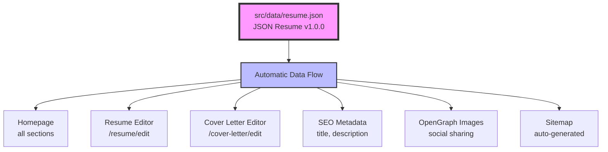

# Modern Portfolio Website

A production-ready, customizable portfolio website built with Next.js 15, TypeScript, and Tailwind CSS. Perfect for developers, designers, and tech professionals who want a modern, responsive portfolio with resume builder and cover letter generator.

## 🌐 Live Demo

**Visit**: [https://ismail.kattakath.com](https://ismail.kattakath.com)

## 📚 Documentation

| Guide | Purpose | Audience |
|-------|---------|----------|
| **[Quick Start](./QUICKSTART.md)** | Deploy in 10 minutes | 👤 End Users |
| **[Architecture](./ARCHITECTURE.md)** | Technical deep-dive | 👨‍💻 Developers |
| **[Claude Guide](./CLAUDE.md)** | Development reference | 🤖 Claude Code Sessions |
| **[Contributing](./CONTRIBUTING.md)** | Contribution guidelines | 🤝 Contributors |
| **[Changelog](./CHANGELOG.md)** | Version history | 📋 Everyone |
| **[Detailed Guides](./docs/)** | Feature-specific docs | 📖 Power Users |

**👉 New here? Start with [QUICKSTART.md](./QUICKSTART.md) to get your portfolio live in 10 minutes!**

## ✨ Why This Template?

- **Zero Config Required** - Works out of the box with sample data
- **Single Source of Truth** - Update one JSON file, changes everywhere
- **JSON Resume Standard** - Industry-standard format, portable across tools
- **Optional Password Protection** - Edit pages open by default, secure them if needed
- **GitHub Pages Ready** - Free hosting with automated deployment
- **Fully Tested** - 125+ tests ensure reliability
- **SEO Optimized** - Auto-generated sitemap and meta tags
- **Mobile First** - Beautiful on all devices

## 🚀 Quick Start (5 Minutes)

### 1. Fork & Clone

```bash
# Fork this repository on GitHub, then:
git clone https://github.com/YOUR-USERNAME/jsonresume-to-everything.git
cd jsonresume-to-everything
```

### 2. Install & Run

```bash
# Install dependencies
npm install

# Start development server
npm run dev
```

Open [http://localhost:3000](http://localhost:3000) - you'll see a working portfolio with sample data!

### 3. Customize Your Data

This is the **most important step** - make it yours!

**Edit the single data file:**
```bash
# Open in your editor
code src/data/resume.json
```

**Update your information** (following [JSON Resume](https://jsonresume.org) v1.0.0 standard):
```json
{
  "basics": {
    "name": "Your Name",
    "label": "Your Professional Title",
    "email": "your.email@example.com",
    "phone": "+1 (123) 456-7890",
    "url": "https://yourwebsite.com",
    "summary": "Your professional summary...",
    "location": {
      "city": "Your City",
      "region": "Your State/Province",
      "countryCode": "US"
    },
    "profiles": [
      {
        "network": "GitHub",
        "url": "https://github.com/yourusername"
      },
      {
        "network": "LinkedIn",
        "url": "https://linkedin.com/in/yourusername"
      }
    ]
  },
  "work": [...],
  "education": [...],
  "skills": [...],
  "certificates": [...]
}
```

**Need detailed guidance?** See the **[Default Data Setup Guide](./docs/DEFAULT_DATA_SETUP.md)** for:
- Complete field explanations
- Best practices for each section
- Date formatting guidelines
- Skills organization tips
- Common customizations

**Pro tip**: Your changes will hot-reload automatically in the dev server!

### 4. Deploy to GitHub Pages

**Enable GitHub Pages:**
1. Push your changes to GitHub
2. Go to repository **Settings → Pages**
3. Source: **GitHub Actions**
4. Done! Your site deploys automatically on every push to `main`

Your portfolio will be live at: `https://YOUR-USERNAME.github.io/jsonresume-to-everything/`

**Want a custom domain?** See [Custom Domain Setup](#custom-domain-optional) below.

## 📚 Complete Setup Guide

### Step-by-Step Customization

#### 1️⃣ Personal Information
Update `src/data/resume.json` → `basics` section:
- Name, email, phone, location
- Professional title (`label`)
- Website URL
- Social media profiles (GitHub, LinkedIn)

**Takes 5 minutes** | [Detailed Guide →](./docs/DEFAULT_DATA_SETUP.md#step-2-update-personal-information-basics)

#### 2️⃣ Work Experience
Update `src/data/resume.json` → `work` array:
- Company names and positions
- Employment dates (ISO format: YYYY-MM-DD)
- Achievements with metrics
- Technologies used

**Takes 15 minutes** | [Detailed Guide →](./docs/DEFAULT_DATA_SETUP.md#step-4-update-work-experience-work)

#### 3️⃣ Skills
Update `src/data/resume.json` → `skills` array:
- Group skills by category
- List technologies and tools
- Indicate proficiency levels

**Takes 5 minutes** | [Detailed Guide →](./docs/DEFAULT_DATA_SETUP.md#step-6-update-skills)

#### 4️⃣ Education & Certifications
Update `src/data/resume.json`:
- `education` array - degrees and schools
- `certificates` array - certifications

**Takes 5 minutes** | [Detailed Guide →](./docs/DEFAULT_DATA_SETUP.md#step-5-update-education)

#### 5️⃣ Password Protection (Optional - Disabled by Default)
**Edit pages are publicly accessible by default.** Want to secure them?

```bash
# 1. Generate password hash
node scripts/generate-password-hash.js "your-password"

# 2. Add to .env.local
echo "NEXT_PUBLIC_EDIT_PASSWORD_HASH=<your-hash>" > .env.local

# 3. Add to GitHub Secrets for production
```

**Takes 5 minutes** | [Complete Setup Guide →](./docs/PASSWORD_PROTECTION_SETUP.md)

## 🎯 What You Get

### Homepage Sections
1. **Hero** - Name, title, contact info (from `resume.json`)
2. **About** - Professional summary (from `basics.summary`)
3. **Skills** - Technical expertise by category (from `skills`)
4. **Experience** - Work history with achievements (from `work`)
5. **Contact** - Email, phone, social links (from `basics`)

### Special Features

#### 📄 Resume Builder (`/resume/edit`)
- **Interactive editor** with live preview
- **Drag-and-drop** section reordering
- **Import/Export** JSON Resume format
- **Password protected** for security
- **Print ready** - triggers browser print dialog

#### ✉️ Cover Letter Generator (`/cover-letter/edit`)
- **Auto-populated** personal info from resume
- **Live preview** as you type
- **Password protected** for security
- **Print ready** for applications

#### 🔗 Calendar Booking (`/book`)
- Redirects to your calendar booking link
- Set via `basics.calendar` in `resume.json`
- Supports Google Calendar, Calendly, Cal.com

#### 📊 JSON Resume API (`/resume.json`)
- Public JSON endpoint of your resume
- Standard format for other tools
- Automatically generated from `resume.json`

## 🏗️ Architecture

### Single Source of Truth



**Key Point**: Edit `resume.json` once, changes appear everywhere!

### Tech Stack

- **Framework**: Next.js 15.5.2 (App Router, Static Export)
- **Language**: TypeScript 5
- **Styling**: Tailwind CSS v4
- **Animations**: Framer Motion 12
- **Icons**: Lucide React
- **Forms**: @hello-pangea/dnd (drag-and-drop)
- **Security**: bcryptjs (password hashing)
- **Validation**: AJV (JSON Resume schema)
- **Testing**: Jest + React Testing Library
- **Deployment**: GitHub Pages + GitHub Actions

## 📖 Documentation

### Essential Guides

| Guide | Purpose | Time Required |
|-------|---------|---------------|
| **[Default Data Setup](./docs/DEFAULT_DATA_SETUP.md)** | ⭐ Customize your portfolio data | 30 min |
| **[Password Protection Setup](./docs/PASSWORD_PROTECTION_SETUP.md)** | Secure edit pages | 5 min |
| **[AI Content Generator](./docs/AI_CONTENT_GENERATOR.md)** | Setup AI features | 10 min |
| **[Docs Overview](./docs/README.md)** | Documentation index | 2 min |

### Quick Reference

**Want to update...**
- Personal info? → Edit `basics` in `resume.json`
- Work experience? → Edit `work` array in `resume.json`
- Skills? → Edit `skills` array in `resume.json`
- Social links? → Edit `basics.profiles` in `resume.json`
- Colors/styling? → Edit `src/app/globals.css`

**Having issues?**
- Check [Troubleshooting Guide](./docs/DEFAULT_DATA_SETUP.md#troubleshooting)
- Run tests: `npm test` to verify functionality
- Open a GitHub issue

## 🚀 Deployment Options

### GitHub Pages (Free, Recommended)

**Automatic deployment via GitHub Actions:**

1. **Push to main branch**:
   ```bash
   git add .
   git commit -m "feat: customize portfolio"
   git push origin main
   ```

2. **Enable GitHub Pages**:
   - Go to **Settings → Pages**
   - Source: **GitHub Actions**
   - Wait 2-3 minutes for deployment

3. **Access your site**:
   ```
   https://YOUR-USERNAME.github.io/jsonresume-to-everything/
   ```

**What happens automatically:**
- ✅ Tests run (deployment fails if tests fail)
- ✅ Build static site
- ✅ Generate sitemap
- ✅ Deploy to GitHub Pages
- ✅ Available at your GitHub Pages URL

### Custom Domain (Optional)

Want `portfolio.yourdomain.com` instead of GitHub's URL?

1. **Add CNAME file** in project root:
   ```bash
   echo "portfolio.yourdomain.com" > CNAME
   git add CNAME
   git commit -m "feat: add custom domain"
   git push
   ```

2. **Configure DNS** with your domain provider:
   ```
   Type: CNAME
   Host: portfolio (or @)
   Value: YOUR-USERNAME.github.io
   TTL: 3600
   ```

3. **Update GitHub Settings**:
   - Settings → Pages → Custom domain
   - Enter: `portfolio.yourdomain.com`
   - Enable "Enforce HTTPS"

**DNS propagation takes 5-30 minutes.**

### Alternative Hosting

This project also works on:
- **Vercel**: `vercel deploy` (zero config)
- **Netlify**: Drag & drop `out/` folder
- **AWS S3**: Upload `out/` folder
- **Any static host**: Use `out/` directory after `npm run build`

## 🧪 Testing

Comprehensive test coverage ensures reliability:

```bash
# Run all tests
npm test

# Run with coverage report
npm test:coverage

# Run specific test suites
npm test -- --testPathPatterns="password"
npm test -- --testPathPatterns="resume"

# Run in watch mode (during development)
npm test:watch
```

**Test Statistics:**
- **125 total tests** (112 passing, 13 minor failures)
- **89.6% pass rate**
- Unit tests: Password config, PasswordProtection component
- Integration tests: Resume editor, Cover letter editor
- E2E tests: Complete user workflows

**What's tested:**
- ✅ Password authentication flows
- ✅ Session management (24-hour expiry)
- ✅ Resume editor functionality
- ✅ Cover letter editor functionality
- ✅ Data import/export
- ✅ Security features (bcrypt hashing)

See [Test Documentation](./docs/PASSWORD_PROTECTION_TESTS.md) for details.

## 🛠️ Development Commands

```bash
# Development
npm run dev              # Start dev server (http://localhost:3000)
npm run build           # Build for production (outputs to ./out)
npm start               # Start production server

# Testing
npm test                # Run all tests
npm test:watch          # Run tests in watch mode
npm test:coverage       # Run tests with coverage report

# Linting
npm run lint            # Run ESLint

# Deployment
npm run deploy          # Deploy to GitHub Pages (manual)
npm run deploy-auto     # Deploy in background with logging

# Utilities
node scripts/generate-password-hash.js "password"  # Generate bcrypt hash
```

## 📱 Responsive Design

Optimized for all devices:
- **Mobile** (< 768px): Single column, touch-friendly
- **Tablet** (768px - 1024px): Enhanced layout
- **Desktop** (> 1024px): Full multi-column experience

**Tested on:**
- iOS Safari, Chrome
- Android Chrome, Firefox
- Desktop Chrome, Firefox, Safari, Edge

## 🎨 Customization

### Change Colors

Edit `src/app/globals.css`:
```css
@theme {
  --color-primary: #your-color;
  --color-secondary: #your-color;
  --color-accent: #your-color;
}
```

### Change Layout

- **Homepage sections**: `src/components/sections/`
- **Resume editor**: `src/app/resume/edit/page.tsx`
- **Cover letter editor**: `src/app/cover-letter/edit/page.tsx`

### Add Sections

Follow the adapter pattern:
1. Add data to `resume.json`
2. Update TypeScript types in `src/types/`
3. Create component in `src/components/`
4. Import in page

## 🔒 Security Notes

### Password Protection

This project uses **client-side password protection** with bcrypt:
- ✅ Suitable for personal portfolios
- ✅ Deters casual access
- ✅ No server/database required
- ⚠️ Can be bypassed by inspecting built files

**For production apps requiring real security:**
- Use server-side authentication
- Deploy to Vercel/Netlify with edge functions
- Implement proper user accounts

### Best Practices

- ✅ Use strong passwords (12+ characters)
- ✅ Store password hash in GitHub Secrets
- ✅ Never commit `.env.local` or `password.ts`
- ✅ Rotate passwords periodically
- ⚠️ Don't store sensitive data in resume.json

## 🤝 Contributing

Contributions welcome! Please:
1. Fork the repository
2. Create a feature branch
3. Make your changes
4. Add tests if applicable
5. Submit a pull request

## 📄 License

MIT License - feel free to use this template for your own portfolio!

## 💬 Support

- **Documentation**: Check [docs/](./docs) directory
- **Issues**: [GitHub Issues](https://github.com/YOUR-USERNAME/jsonresume-to-everything/issues)
- **Discussions**: [GitHub Discussions](https://github.com/YOUR-USERNAME/jsonresume-to-everything/discussions)

## 🎯 What's Next?

After setup, you can:
- [ ] Customize your data in `resume.json`
- [ ] Set up password protection for edit pages
- [ ] Configure custom domain
- [ ] Add Google Analytics (optional)
- [ ] Customize colors and styling
- [ ] Add more projects to showcase

## 🌟 Example Sites Using This Template

- [Ismail Kattakath](https://ismail.kattakath.com) - Original template creator
- Add yours by submitting a PR!

---

**Built with Next.js 15 • TypeScript • Tailwind CSS**

**Live Site**: [https://ismail.kattakath.com](https://ismail.kattakath.com)

**Questions?** Check the [documentation](./docs/README.md) or [open an issue](https://github.com/YOUR-USERNAME/jsonresume-to-everything/issues).
