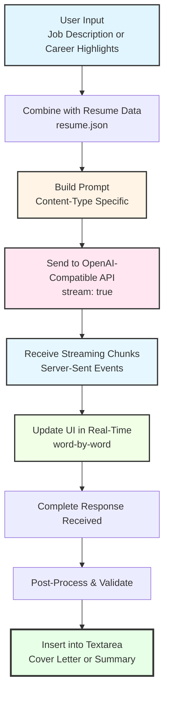

# AI Content Generator

## Overview

The AI Content Generator is a client-side feature that allows users to automatically generate AI-powered content for their portfolio. It integrates with OpenAI-compatible APIs to create professional, tailored content including:

- **Cover Letters**: Customized cover letters based on resume data and job descriptions
- **Professional Summaries**: Compelling resume summaries highlighting key strengths and experience

**Requirements:**
- OpenAI API credentials (API key)
- OpenAI-compatible API endpoint (OpenAI, Azure OpenAI, or local LLM servers like LM Studio)
- Internet connection (for remote APIs) or local AI server running

## Features

- ✨ **AI-Powered Generation**: Leverages OpenAI-compatible APIs to generate tailored content (cover letters, summaries)
- 🔒 **Client-Side Processing**: All API calls happen in the browser - no backend required
- 💾 **Credential Persistence**: Optionally save API credentials locally for convenience
- 🎯 **Smart Prompting**: Intelligent prompt engineering that combines resume data with context-specific requirements
- ✅ **Accuracy Guarantee**: AI is strictly instructed to ONLY use qualifications and experiences from your actual resume data - no fabrication allowed
- 🛡️ **Validation**: Built-in checks to detect and warn about potential unverified claims
- 🌊 **Real-Time Streaming**: See AI generate your content in real-time with live streaming
- ⚡ **No Timeouts**: Streaming eliminates arbitrary timeouts - works with thinking models that need minutes
- 🔐 **Secure**: Credentials stored locally in browser, never sent to external servers (except your configured API)
- ♿ **Accessible**: Full keyboard support and screen reader compatibility
- 🔄 **Multiple Use Cases**: Reusable across different content types (cover letters, professional summaries)

## User Interface

### Generate with AI Button

The AI generation feature is available in multiple locations:

**1. Cover Letter Editor (`/cover-letter/edit`)** - Bottom of content textarea:
```
┌─────────────────────────────────────────────┐
│  ✨ Generate with AI                        │
│  Let AI craft your cover letter             │
└─────────────────────────────────────────────┘
```

**2. Resume Editor (`/resume/edit`)** - Professional Summary section:
```
┌─────────────────────────────────────────────┐
│  ✨ Generate with AI                        │
│  Let AI craft your summary                  │
└─────────────────────────────────────────────┘
```

### AI Generation Modal

When clicked, opens a modal with:

1. **API URL** - Enter your OpenAI-compatible endpoint:
   - OpenAI: `https://api.openai.com` (default)
   - Azure OpenAI: `https://your-resource.openai.azure.com`
   - Local LM Studio: `http://localhost:1234` or custom address
2. **API Key** - Password field with show/hide toggle (required)
   - Get from: https://platform.openai.com/api-keys (for OpenAI)
   - Or your local server's configuration
3. **Remember Credentials** - Checkbox to save credentials locally
4. **Context Input** - Large textarea for providing context:
   - **Cover Letter**: Paste job description
   - **Professional Summary**: Additional career highlights or focus areas (optional)
5. **Generate Button** - Triggers the AI generation

## How It Works

### 1. User Flow

1. User clicks "Generate with AI" button
2. Modal opens with form fields
3. User enters:
   - API URL (or uses default)
   - API Key
   - Context input (job description for cover letters, or optional highlights for summaries)
4. Optionally checks "Remember credentials"
5. Clicks "Generate" button
6. AI streams response in real-time (you see content as it's generated!)
7. Generated content replaces the textarea content
8. Modal closes automatically

### 2. Technical Flow



### 3. Streaming Architecture

The application uses **Server-Sent Events (SSE)** for real-time streaming:

1. **Request**: Sets `stream: true` in OpenAI API request
2. **Response**: Receives `text/event-stream` with `data:` prefixed JSON chunks
3. **Parsing**: Extracts `delta.content` from each chunk
4. **UI Update**: Appends content to display in real-time
5. **Auto-Scroll**: Automatically scrolls to show latest content
6. **Completion**: Detects `[DONE]` message to finalize

**Benefits over non-streaming:**
- ✅ **No arbitrary timeouts** - works as long as server responds
- ✅ **Real-time feedback** - user sees progress immediately
- ✅ **Better UX** - engaging visual feedback during generation
- ✅ **Thinking model support** - perfect for models that reason before answering
- ✅ **Network resilience** - progressive delivery vs. all-or-nothing

### 4. Prompt Engineering

The system builds content-specific prompts based on the generation type:

#### Cover Letter Prompt
- **Candidate Info**: Name, position, contact details
- **Professional Summary**: From resume.json
- **Work Experience**: Top 3 most recent positions with achievements
- **Skills**: Relevant technical and soft skills
- **Job Description**: User-provided job posting
- **Generation Instructions**: Specific formatting and style guidelines
- **CRITICAL ACCURACY RULES**: Explicit instructions to ONLY use information from the provided resume data

#### Professional Summary Prompt
- **Candidate Info**: Name, current position
- **Work Experience**: Complete work history with key achievements
- **Skills**: All technical and professional skills
- **Education & Certifications**: Academic and professional credentials
- **Optional Context**: User-provided career highlights or focus areas
- **Generation Instructions**: Concise, impactful summary style (150-200 words)
- **CRITICAL ACCURACY RULES**: Explicit instructions to ONLY use information from the provided resume data

Example prompt structure (Cover Letter):
```
You are a professional cover letter writer. Write based STRICTLY on the
candidate information provided below.

CANDIDATE INFORMATION:
Name: John Doe
Current Role: Senior Software Engineer
Professional Summary: [...]
Key Experience: [...]
Technical Skills: [...]

JOB DESCRIPTION:
[User-provided job posting]

CRITICAL REQUIREMENTS - YOU MUST FOLLOW THESE EXACTLY:
1. ONLY mention qualifications, skills, and experiences explicitly listed above
2. DO NOT invent, assume, or fabricate ANY qualifications not shown above
3. DO NOT claim skills not listed in their technical skills
4. DO NOT reference companies or achievements not mentioned in their experience
5. If the job requires something the candidate doesn't have, DO NOT claim they have it
6. Use ONLY the specific metrics and details provided in the candidate's experience

WRITING INSTRUCTIONS:
1. Write 3-4 paragraphs (250-350 words)
2. Highlight 2-3 relevant achievements from the candidate's ACTUAL experience
3. Show how DOCUMENTED skills solve employer needs
4. Use ONLY specific metrics from the candidate's background provided above
5. NO salutation or signature
[...]

ACCURACY VERIFICATION:
Before writing each sentence, verify that ANY claim about the candidate's
background is explicitly stated in the candidate information above.
```

**This ensures the AI never fabricates qualifications or experiences not in your resume!**

Example prompt structure (Professional Summary):
```
You are a professional resume writer specializing in impactful executive summaries.
Write based STRICTLY on the candidate information provided below.

CANDIDATE INFORMATION:
Name: John Doe
Current Role: Senior Software Engineer
Work Experience: [Complete history with achievements]
Skills: [All technical and professional skills]
Education: [Degrees and certifications]

CRITICAL REQUIREMENTS - YOU MUST FOLLOW THESE EXACTLY:
1. ONLY mention qualifications, skills, and experiences explicitly listed above
2. DO NOT invent, assume, or fabricate ANY qualifications not shown above
3. Create a 150-200 word professional summary
4. Highlight 3-4 key strengths from their ACTUAL experience
5. Use specific metrics from their background provided above
6. Write in third person, professional tone
7. Focus on value proposition and unique qualifications

ACCURACY VERIFICATION:
Before writing each sentence, verify that ANY claim about the candidate's
background is explicitly stated in the candidate information above.
```

### 5. API Integration

Compatible with any OpenAI-compatible API:

**Streaming Request Format:**
```json
POST {baseURL}/v1/chat/completions
{
  "model": "openai/gpt-oss-20b",
  "messages": [
    {
      "role": "system",
      "content": "You are a professional cover letter writer..."
    },
    {
      "role": "user",
      "content": "[Generated prompt with resume + job description]"
    }
  ],
  "temperature": 0.7,
  "max_tokens": 800,
  "stream": true
}
```

**Streaming Response (Server-Sent Events):**
```
data: {"id":"chatcmpl-123","choices":[{"index":0,"delta":{"role":"assistant"},"finish_reason":null}]}

data: {"id":"chatcmpl-123","choices":[{"index":0,"delta":{"content":"I"},"finish_reason":null}]}

data: {"id":"chatcmpl-123","choices":[{"index":0,"delta":{"content":"'m"},"finish_reason":null}]}

data: {"id":"chatcmpl-123","choices":[{"index":0,"delta":{"content":" a"},"finish_reason":null}]}

...

data: [DONE]
```

## Setup & Configuration

### Option 1: OpenAI API (Recommended for Most Users)

1. **Get OpenAI API Key**
   - Visit https://platform.openai.com/api-keys
   - Sign up or log in
   - Create a new API key
   - Copy the key (starts with `sk-...`)

2. **Configure in Application**
   - API URL: `https://api.openai.com`
   - API Key: Your OpenAI API key (e.g., `sk-proj-...`)
   - Model: `gpt-4` or `gpt-3.5-turbo` (automatically configured)

3. **Costs**
   - Typical cover letter: ~800 tokens (~$0.01-0.03 per generation)
   - See pricing: https://openai.com/pricing

### Option 2: Azure OpenAI

1. **Setup Azure OpenAI Resource**
   - Create resource in Azure Portal
   - Deploy a model (GPT-4 or GPT-3.5-turbo)
   - Get endpoint URL and API key

2. **Configure in Application**
   - API URL: `https://your-resource.openai.azure.com`
   - API Key: Your Azure API key
   - Model: Your deployment name

### Option 3: Local AI Server (LM Studio)

**For users who want to run AI locally without cloud APIs:**

1. **Install LM Studio** or similar OpenAI-compatible server
   - Download from: https://lmstudio.ai
   - Or use alternatives: Ollama, LocalAI, etc.

2. **Start Server** with model loaded
   - Standard models: `openai/gpt-oss-20b`, `meta-llama-3.1-8b-instruct`
   - Thinking models: `allenai/olmo-3-32b-think`, `deepseek-r1` (slower but more thorough)
   - Ensure server runs on accessible port (e.g., `1234`)

3. **Configure CORS** - Ensure server allows browser requests:
   ```
   Access-Control-Allow-Origin: *
   Access-Control-Allow-Methods: POST, OPTIONS
   Access-Control-Allow-Headers: Content-Type, Authorization
   ```

4. **Configure in Application**
   - API URL: `http://localhost:1234` or `http://10.237.207.139:1234`
   - API Key: Your server's API key (or `sk-local` if none required)
   - Model: `openai/gpt-oss-20b` or your model ID

**Local Server Benefits:**
- ✅ No API costs
- ✅ Full data privacy
- ✅ Works offline
- ✅ Real-time streaming feedback shows progress
- ⚠️ Requires powerful hardware (8GB+ RAM, GPU recommended)
- ⚠️ Variable generation time (streaming shows progress regardless of duration)

### Using the Feature

#### For Cover Letters
1. Navigate to `/cover-letter/edit`
2. Enter password (if protected)
3. Click "Generate with AI" button at bottom of content textarea
4. First time:
   - Enter API URL (OpenAI: `https://api.openai.com`, Local: `http://localhost:1234`)
   - Enter API Key (required)
   - Check "Remember credentials" to save API credentials for next time
   - Paste job description (automatically saved)
5. Click "Generate Cover Letter"
6. Next time: Job description is pre-filled, just update if needed!

#### For Professional Summaries
1. Navigate to `/resume/edit`
2. Enter password (if protected)
3. Scroll to "Professional Summary" section
4. Click "Generate with AI" button at bottom of summary textarea
5. First time:
   - Enter API URL and API Key (same as cover letter)
   - Optionally add career highlights or focus areas
6. Click "Generate Summary"
7. AI generates a compelling 150-200 word professional summary based on your resume data

## Data Persistence

### How It Works

- **Credentials**: Stored in browser's `localStorage` (opt-in via checkbox)
- **Job Description**: Always saved automatically for convenience
- **Storage key**: `ai_cover_letter_credentials`
- **Format**: JSON string with `{ apiUrl, apiKey, rememberCredentials, lastJobDescription }`

### What Gets Saved

**Always Saved:**
- ✅ Last job description for cover letters (auto-saved every time you generate)
- ✅ Last context input for summaries (auto-saved every time you generate)
- Purpose: Avoid re-entering the same context

**Conditionally Saved (opt-in):**
- 🔐 API URL (only if "Remember credentials" is checked)
- 🔐 API Key (only if "Remember credentials" is checked)

**Note**: Credentials are shared across all AI generation features (cover letters and summaries)

### Security Considerations

- ✅ **Client-side only** - API credentials never sent to portfolio website servers
- ✅ **Local storage** - Stays in user's browser only
- ✅ **User consent** - Opt-in via checkbox
- ⚠️ **Plain text** - Stored unencrypted (browser localStorage limitation)
- 🔒 **Recommendation** - Only use on personal/trusted devices
- 🔐 **OpenAI API Keys** - Treat like passwords, never share publicly
- ⚠️ **API Costs** - Monitor your OpenAI usage dashboard to avoid unexpected charges

### Clearing Data

**Credentials** are cleared when:
- User unchecks "Remember credentials" and generates new letter
- User clears browser data/localStorage

**Context Input** (job description or career highlights) persists until:
- User manually clears browser data/localStorage
- User generates with empty context input

**Note**: Even with "Remember credentials" unchecked, context input remains saved for your convenience.

## Error Handling

### Common Errors & Solutions

1. **"Unable to connect to AI server"**
   - **Cause**: Server unreachable or URL incorrect
   - **Solution**: Check API URL, ensure server is running, verify CORS settings

2. **"Authentication failed"**
   - **Cause**: Invalid API key
   - **Solution**: Verify API key is correct, check server authentication requirements

3. **"Request timed out"**
   - **Cause**: Server overloaded or slow model
   - **Solution**: Wait and retry, consider using faster model

4. **"AI generated an empty response"**
   - **Cause**: Model failed to generate content or context input unclear
   - **Solution**: Rephrase context input, add more details, or try without optional context

5. **"Rate limit exceeded"**
   - **Cause**: Too many requests to API
   - **Solution**: Wait a few minutes before retrying

## Keyboard Shortcuts

- **Open Modal**: Click button or Tab to button + Enter
- **Generate**: `Ctrl/Cmd + Enter` in Job Description textarea
- **Close Modal**: `Escape` key
- **Toggle Password**: Tab to eye icon + Enter

## Architecture

### File Structure

```
src/
├── components/
│   ├── ui/
│   │   └── Modal.tsx                          # Reusable modal component
│   ├── document-builder/
│   │   └── shared-forms/
│   │       └── AITextAreaWithButton.tsx       # Reusable textarea with AI button
│   ├── cover-letter/
│   │   └── forms/
│   │       ├── CoverLetterContent.tsx         # Cover letter editor with AI button
│   │       └── AIGenerateModal.tsx            # Cover letter AI modal
│   └── resume/
│       └── forms/
│           ├── Summary.tsx                    # Summary editor with AI button
│           └── AIGenerateSummaryModal.tsx     # Summary AI modal
├── lib/
│   ├── services/
│   │   └── openai.ts                          # OpenAI API client service
│   └── prompts/
│       ├── coverLetter.ts                     # Cover letter prompt engineering
│       └── summary.ts                         # Summary prompt engineering
└── types/
    └── openai.ts                              # TypeScript types
```

### Components

**Modal.tsx**
- Reusable modal wrapper
- Framer Motion animations
- Keyboard & accessibility support
- Backdrop click-to-close

**AITextAreaWithButton.tsx**
- Reusable textarea component with integrated AI button
- Used across multiple content types (cover letters, summaries)
- Consistent UI pattern for AI generation

**AIGenerateModal.tsx** (Cover Letter)
- Form for API credentials & job description
- State management for loading/errors
- Credential persistence
- API call orchestration for cover letter generation

**AIGenerateSummaryModal.tsx** (Professional Summary)
- Form for API credentials & optional highlights
- Specialized prompt for summary generation
- Shares credential storage with cover letter modal

**CoverLetterContent.tsx**
- Cover letter editor
- Integrates AITextAreaWithButton
- Modal integration

**Summary.tsx**
- Professional summary editor
- Integrates AITextAreaWithButton
- Modal integration

### Services

**openai.ts**
- API client for OpenAI-compatible endpoints
- Request/response handling
- Streaming support (Server-Sent Events)
- Error wrapping (OpenAIAPIError)
- Credential storage (localStorage)

**coverLetter.ts**
- Prompt builder (resume + job description → prompt)
- Content validator (length, placeholders)
- Post-processor (formatting, cleanup)

**summary.ts**
- Prompt builder (resume + optional highlights → prompt)
- Summary-specific validation (150-200 words)
- Professional tone optimization

## Testing

Comprehensive test coverage:

- ✅ **AITextAreaWithButton**: Component tests for reusable UI
- ✅ **Modal**: 12 tests (accessibility, keyboard, animations)
- ✅ **OpenAI Service**: 14 tests (API calls, errors, storage, streaming)
- ✅ **Cover Letter Prompts**: 23 tests (prompt building, validation)
- ✅ **Summary Prompts**: Tests for summary-specific generation

Run tests:
```bash
npm test -- AITextAreaWithButton.test
npm test -- Modal.test
npm test -- openai.test
npm test -- coverLetter.test
npm test -- summary.test
```

## Performance

- **API Call**: 3-10 seconds for standard models (OpenAI GPT-4, GPT-3.5)
- **Thinking Models**: Variable time for models with reasoning (e.g., OLMo-3-32B-Think, DeepSeek R1)
- **Streaming**: Real-time content delivery with no arbitrary timeouts - works with any model speed
- **Bundle Size**: ~17KB (gzipped, including streaming support)
- **No Server Load**: All processing client-side

## Future Enhancements

Potential improvements:

1. **Multiple Model Support**: Allow switching between models
2. **Tone Selection**: Professional, casual, enthusiastic presets
3. **Length Control**: Short vs Long versions
4. **History**: Save previously generated content
5. **Templates**: Pre-built structures for different content types
6. **A/B Testing**: Generate multiple variations
7. **Additional Content Types**:
   - LinkedIn "About" sections
   - Project descriptions
   - Achievement highlights
   - Email introductions

## Troubleshooting

### CORS Issues

If you see CORS errors:

1. Configure your local server to allow browser requests
2. For LM Studio:
   - Settings → Server → Enable CORS
   - Or use a CORS proxy

### Slow Generation

If generation takes too long:

1. Check model size (smaller = faster)
2. Reduce `max_tokens` in request (src/lib/services/openai.ts)
3. Use quantized models (Q4, Q5)

### API Compatibility

If API doesn't work:

1. Verify endpoint follows OpenAI format
2. Check model identifier matches your server
3. Test API with curl first:
   ```bash
   curl http://10.237.207.139:1234/v1/chat/completions \
     -H "Content-Type: application/json" \
     -H "Authorization: Bearer YOUR_KEY" \
     -d '{
       "model": "openai/gpt-oss-20b",
       "messages": [{"role": "user", "content": "Hello"}]
     }'
   ```

## Support

For issues or questions:

1. Check console for errors (F12 → Console)
2. Verify API server is running
3. Test API endpoint independently
4. Review CORS configuration
5. Open issue on GitHub

## Credits

- **OpenAI API Format**: Industry standard for LLM APIs
- **Framer Motion**: Modal animations
- **Lucide React**: Icons
- **Sonner**: Toast notifications
