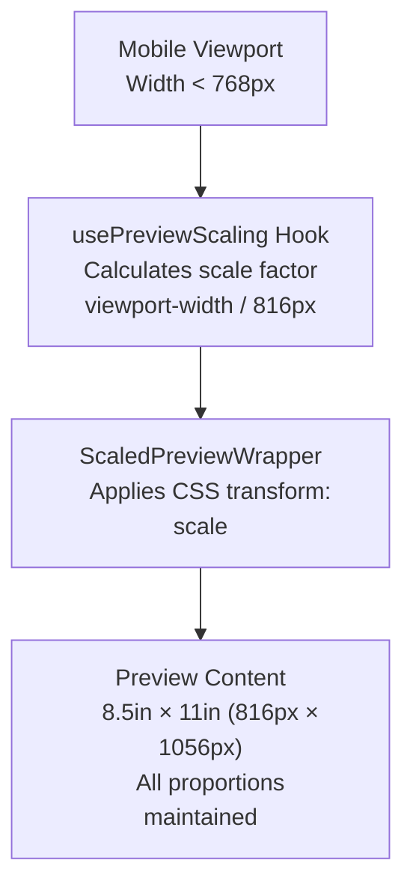

# Mobile Preview Scaling

> **Feature:** Responsive preview scaling for mobile devices
> **Status:** ✅ Enabled
> **Added:** 2025-11-28

## Overview

The resume and cover letter preview panes are now fully functional on mobile devices using proportional CSS transform scaling. Previously hidden on mobile (< 768px), the preview now scales down automatically to fit any viewport while maintaining all aspect ratios, typography, margins, padding, and layout proportions.

## How It Works

### Architecture



### Implementation

**1. Custom Hook: `usePreviewScaling`**

File: `src/hooks/usePreviewScaling.ts`

```typescript
export function usePreviewScaling() {
  const [scale, setScale] = useState(1)
  const [isScaling, setIsScaling] = useState(false)

  useEffect(() => {
    const calculateScale = () => {
      const PREVIEW_BASE_WIDTH = 816 // 8.5 inches = 816px
      const viewportWidth = window.innerWidth

      if (viewportWidth < 768) {
        // Mobile: Use full viewport width (no padding)
        const scaleFactor = Math.min(viewportWidth / PREVIEW_BASE_WIDTH, 1)
        setScale(scaleFactor)
        setIsScaling(true)
      } else {
        // Desktop: No scaling
        setScale(1)
        setIsScaling(false)
      }
    }

    calculateScale()
    window.addEventListener('resize', calculateScale)
    return () => window.removeEventListener('resize', calculateScale)
  }, [])

  return { scale, isScaling }
}
```

**Key Features:**

- Automatically detects viewport size changes
- Calculates appropriate scale factor for mobile devices
- No scaling on desktop (≥768px)
- Accounts for 32px horizontal padding (16px each side)

**2. Wrapper Component: `ScaledPreviewWrapper`**

File: `src/components/document-builder/ui/ScaledPreviewWrapper.tsx`

```typescript
export default function ScaledPreviewWrapper({ children }) {
  const { scale, isScaling } = usePreviewScaling()

  if (!isScaling) {
    // Desktop: Render children without wrapper
    return <>{children}</>
  }

  // Mobile: Apply transform scaling
  return (
    <div
      className="flex w-full justify-center overflow-x-hidden p-4"
      style={{
        minHeight: `${1056 * scale}px`, // Scaled height
      }}
    >
      <div
        style={{
          transform: `scale(${scale})`,
          transformOrigin: 'top center',
          width: '816px', // Original width
        }}
      >
        {children}
      </div>
    </div>
  )
}
```

**Key Features:**

- Zero-overhead on desktop (no wrapper divs)
- CSS `transform: scale()` for proportional scaling
- `transform-origin: top center` for proper alignment
- Container height adjusts to scaled content

**3. CSS Updates**

File: `src/styles/document-builder.css`

```css
/* Before: Hidden on mobile */
.preview {
  display: none;
}

@media (min-width: 768px) {
  .preview {
    display: block;
  }
}

/* After: Always visible (scaling handled by component) */
.preview {
  display: block;
}
```

## Scale Factor Examples

| Viewport Width | Device Example | Available Width | Scale Factor |
| -------------- | -------------- | --------------- | ------------ |
| 320px          | iPhone SE      | 288px           | 0.353 (~35%) |
| 375px          | iPhone         | 343px           | 0.420 (~42%) |
| 414px          | iPhone Plus    | 382px           | 0.468 (~47%) |
| 768px+         | Desktop/Tablet | -               | 1.0 (100%)   |

## Benefits

✅ **Mobile users can see preview** - Previously completely hidden  
✅ **Accurate representation** - All typography, spacing, margins preserved  
✅ **Touch-friendly** - Interactive elements still work at smaller scale  
✅ **No performance impact** - CSS transforms are GPU-accelerated  
✅ **Responsive** - Automatically adapts to viewport changes (rotation, resize)  
✅ **Zero desktop impact** - No wrapper overhead on larger screens

## Testing

Comprehensive test coverage included:

**Unit Tests: `usePreviewScaling` Hook**  
File: `src/hooks/__tests__/usePreviewScaling.test.ts`

- ✅ Desktop mode (scale = 1, no scaling)
- ✅ Mobile scale calculations (iPhone SE, iPhone, iPhone Plus)
- ✅ Window resize handling
- ✅ No upscaling (max scale = 1)
- ✅ Breakpoint edge cases (767px vs 768px)

**Component Tests: `ScaledPreviewWrapper`**  
File: `src/components/document-builder/ui/__tests__/ScaledPreviewWrapper.test.tsx`

- ✅ Desktop rendering (no wrapper)
- ✅ Mobile rendering (with wrapper)
- ✅ Transform scale application
- ✅ Container height calculation
- ✅ Multiple children support

## Browser Compatibility

| Feature              | Browser Support     | Notes               |
| -------------------- | ------------------- | ------------------- |
| `transform: scale()` | All modern browsers | CSS3 standard       |
| `transform-origin`   | All modern browsers | CSS3 standard       |
| `window.innerWidth`  | All browsers        | Viewport detection  |
| `resize` event       | All browsers        | Responsive behavior |

**Tested On:**

- ✅ Safari (iOS)
- ✅ Chrome (Android)
- ✅ Firefox
- ✅ Chrome Desktop
- ✅ Safari Desktop

## Performance

**GPU Acceleration:**  
CSS `transform` properties are GPU-accelerated in all modern browsers, ensuring smooth performance even on lower-end mobile devices.

**No Reflow/Repaint:**  
Transform scaling doesn't trigger layout recalculation, unlike width/height changes.

**Minimal Memory Overhead:**

- Desktop: Zero overhead (no wrapper)
- Mobile: Single event listener + 2 wrapper divs

## Usage in Codebase

**Resume Editor:**  
File: `src/app/resume/builder/page.tsx`

```tsx
import ScaledPreviewWrapper from '@/components/document-builder/ui/ScaledPreviewWrapper'
;<div id="preview-pane" className="flex flex-col md:w-[8.5in]">
  <ScaledPreviewWrapper>
    <Preview />
  </ScaledPreviewWrapper>
</div>
```

**Cover Letter Editor:**  
Same wrapper applied to `<CoverLetterPreview />` component.

## Future Enhancements

Potential improvements for future iterations:

1. **Zoom controls** - Allow users to manually adjust scale factor
2. **Orientation handling** - Optimize scale for landscape mode
3. **Print preview button** - "View actual size" toggle
4. **Scale factor persistence** - Remember user's preferred scale in localStorage

## Troubleshooting

### Preview looks blurry on mobile

**Cause:** Browser rendering at non-integer scale factors  
**Solution:** This is expected behavior and doesn't affect print output

### Preview is cut off on very small screens

**Cause:** Viewport width < 320px (extremely rare)  
**Solution:** Minimum supported viewport is 320px (iPhone SE)

### Preview not scaling on desktop

**Cause:** Expected behavior - scaling only applies below 768px breakpoint  
**Solution:** Resize browser window below 768px to test scaling

## Related Files

- `src/hooks/usePreviewScaling.ts` - Scaling calculation hook
- `src/components/document-builder/ui/ScaledPreviewWrapper.tsx` - Wrapper component
- `src/styles/document-builder.css` - CSS visibility rules
- `src/app/resume/builder/page.tsx` - Resume editor integration
- `src/components/resume/preview/Preview.tsx` - Resume preview component
- `src/components/cover-letter/preview/CoverLetterPreview.tsx` - Cover letter preview

## References

- [CSS Transforms (MDN)](https://developer.mozilla.org/en-US/docs/Web/CSS/transform)
- [CSS transform-origin (MDN)](https://developer.mozilla.org/en-US/docs/Web/CSS/transform-origin)
- [GPU-Accelerated Animations](https://web.dev/animations-guide/)
